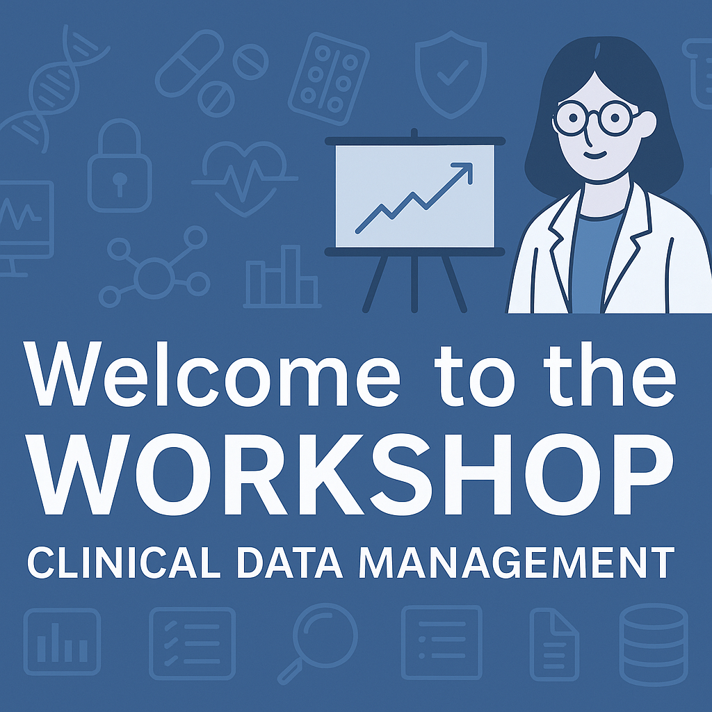

# REDCap for Clinical Studies

## Overview

This repository contains educational materials for a comprehensive course on using REDCap (Research Electronic Data Capture) for clinical studies. The course is designed for doctoral students and researchers looking to implement REDCap for data collection, management, and analysis in their research projects.

## Course Contents

This course covers:

- 📊 **Electronic Data Capture & Regulations** - Understanding ICH-GCP, GDPR, and ALCOA+ principles for data integrity
- 🛠️ **REDCap Project Design** - Instruments, validation, logic, and calculated fields
- 🔄 **Advanced Features** - Surveys, longitudinal studies, and eConsent 2.0
- 📈 **REDCap API Integration** - Interacting with REDCap via RStudio + API using JSON and tidyverse
- 🔐 **Governance** - Managing access, users, logs, and external modules

## Materials

- **RedCap_phd.qmd** - Main presentation slides (Quarto format)
- **RedCap_phd.html** - Compiled presentation slides
- **RedCap_hands_on.Rmd** - Hands-on tutorial (R Markdown)
- **RedCap_hands_on.html** - Compiled hands-on tutorial
- **RedCap_hands_on_API.Rmd** - API tutorial (R Markdown)
- **RedCap_hands_on_API.html** - Compiled API tutorial

## Getting Started

To view the course materials:

1. Clone this repository
2. Open the HTML files in your browser to view the presentations and tutorials
3. For interactive sessions, ensure you have R, RStudio, and the required packages installed

## Requirements

- R and RStudio (for API tutorials)
- Required R packages: redcapAPI, tidyverse
- Access to a REDCap instance for hands-on practice

## License

This content is licensed under [LICENSE.md](LICENSE.md).

## Instructor

Luca Vedovelli, Biostatistician, Clinical Trials Unit

## Acknowledgements

Course materials developed for the Doctoral School program 2025.